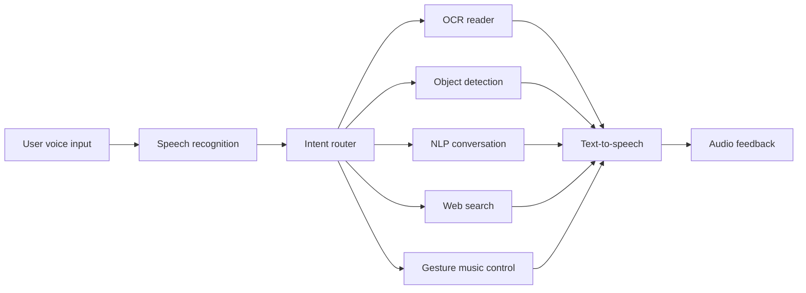
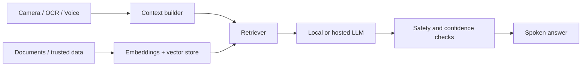

<div align="center">

# Helen

### A Multimodal AI Assistant for Visually Impaired Users

**Voice-first accessibility powered by computer vision, OCR, NLP, and audio feedback.**

[](https://www.python.org/)
[](https://opencv.org/)
[](https://huggingface.co/docs/transformers)
[](#why-helen)

`AI/ML` · `Computer Vision` · `Speech Interfaces` · `Assistive Technology`

</div>

---

## Why Helen?

Most digital experiences assume that a user can see a screen. Helen explores a
different interface: one that listens through a microphone, observes through a
camera, and communicates through spoken feedback.

The project began as an accessibility-focused AI prototype in 2023. Its goal is
to investigate how multiple ML capabilities can work together as a practical,
low-cost assistant for visually impaired users.

> **Core idea:** turn visual information from the physical world into useful,
> voice-accessible context.

## What It Can Do

| Capability | How it works | Example user intent |
| --- | --- | --- |
| **Voice command routing** | SpeechRecognition converts speech to text and routes commands to specialized modules. | `"Describe what you see"` |
| **Natural-language intent resolution** | Offline phrase, keyword, and fuzzy matching maps varied requests to assistant actions. Optional zero-shot Transformers classification handles ambiguous requests. | `"I want to listen to music right now"` |
| **OCR text reader** | A webcam frame is processed with Tesseract OCR and read aloud. | `"Read this text"` |
| **Object detection** | OpenCV DNN processes a camera frame and speaks recognized COCO object labels. | `"What objects are in front of me?"` |
| **Conversational NLP** | Hugging Face pipelines support basic question answering and text generation. | `"Who is OpenAI?"` |
| **Voice-triggered web search** | Spoken search queries are URL-encoded, fetched, parsed, and returned through audio. | `"Search Python programming"` |
| **Gesture music control** | MediaPipe hand tracking detects a gesture and controls local audio playback. | `"Start gesture music control"` |
| **Text-to-speech feedback** | `pyttsx3` provides an audio-first response layer across the assistant. | Spoken response |

## System Architecture



The modules are intentionally separated so individual capabilities can be
evaluated, upgraded, and deployed independently.

## Technical Highlights

- Built a modular multimodal pipeline combining speech, vision, OCR, and NLP.
- Added lazy loading for heavy Transformers models to reduce unnecessary startup
  work.
- Mapped object detector outputs to human-readable COCO labels instead of raw
  numeric class IDs.
- Centralized camera, model, and data paths for more reliable local execution.
- Added graceful failure handling for camera access, empty OCR results, missing
  object-detection models, network failures, and missing music files.
- Designed an audio-first interaction loop that does not require a visual UI.

## Quick Start

### 1. Clone the repository

```bash
git clone https://github.com/apexajay-rc/helen.git
cd helen
```

### 2. Create a virtual environment

```bash
python -m venv .venv
```

Activate it on Windows:

```powershell
.\.venv\Scripts\Activate.ps1
```

Activate it on Linux or macOS:

```bash
source .venv/bin/activate
```

### 3. Install dependencies

```bash
python -m pip install -r requirements.txt
```

Tesseract OCR must also be installed on your operating system. On Windows,
install the [Tesseract OCR engine](https://github.com/tesseract-ocr/tesseract)
in its standard `C:\Program Files\Tesseract-OCR` directory. Helen detects that
path automatically. On Linux or macOS, make sure `tesseract` is available on
your `PATH`.

The default requirements install only the dependencies used by the current
prototype. To experiment with planned Whisper, YOLO, and local-LLM features,
install the optional edge stack afterward:

```bash
python -m pip install -r requirements-edge.txt
```

### 4. Add object-detection model files

Download the computer-vision model assets:

```bash
cd helen
python setup_models.py
```

This downloads the MobileNet SSD object detector and MediaPipe Hand Landmarker
bundle into the git-ignored `helen/models/` directory. The assistant provides a
spoken warning instead of crashing if assets have not been downloaded yet.

### 5. Run Helen

Launch the Qt Quick desktop application:

```bash
python desktop_app.py
```

The desktop app provides an animated listening/speaking orb, accessible quick
actions, a microphone button, a typed-command fallback, activity history,
high-contrast mode, and reduced-motion mode.

To launch the temporary Tkinter test harness instead:

```bash
python ui.py
```

To run the original terminal loop:

```bash
python assistant.py
```

Helen accepts natural phrasing rather than requiring exact commands. For
optional zero-shot deep-learning intent classification on ambiguous requests,
set `HELEN_ENABLE_SEMANTIC_INTENTS=1` before launching the assistant. The first
semantic request may download the classifier model.

## Example Commands

```text
"Read this text"
"Describe the objects in front of me"
"Search assistive technology"
"Start gesture music control"
"Quit"
```

## Project Structure

```text
helen/
├── architecture.md
├── requirements.txt
└── helen/
    ├── assistant.py                 # Voice loop and intent router
    ├── desktop_app.py               # PySide6 bridge for the desktop product
    ├── setup_models.py              # One-command vision model download
    ├── ui.py                        # Temporary Tkinter test harness
    ├── qml/Main.qml                 # Qt Quick desktop interface
    ├── core/
    │   ├── gesture_music_control.py # MediaPipe gesture recognition
    │   ├── nlp.py                   # Hugging Face NLP pipelines
    │   ├── object_detection.py      # OpenCV DNN object detection
    │   ├── ocr.py                   # Tesseract OCR reader
    │   └── voice_search.py          # Search and spoken result flow
    ├── data/songs/                  # Local audio assets
    └── utils/
        ├── audio.py                 # Text-to-speech output
        └── config.py                # Paths and runtime configuration
```

## From Prototype to Frontier

Helen is currently a software prototype. The next iterations are aimed at
turning it into a more rigorous, evaluation-driven assistive AI system.

| Phase | Focus | Planned outcome |
| --- | --- | --- |
| **Phase 1** | Reliable offline perception | Upgrade object detection, benchmark latency, improve OCR preprocessing |
| **Phase 2** | Multimodal RAG | Ask grounded questions about scanned documents, labels, and personal knowledge |
| **Phase 3** | Context-aware assistance | Combine scene understanding, depth estimation, and confidence-aware responses |
| **Phase 4** | Wearable deployment | Prototype a low-cost camera and audio wearable using phone or Raspberry Pi compute |

### RAG Direction

A future retrieval-augmented generation pipeline could transform Helen from a
feature-based assistant into a grounded multimodal agent:



Example use case:

```text
User: "What matters in this bill?"
Helen: "The amount due is 1,280 rupees. The due date is June 5."
```

## Engineering Roadmap

- [x] Voice-controlled multimodal assistant loop
- [x] Camera-based OCR with spoken output
- [x] COCO label mapping for object detection
- [x] Failure handling for common runtime issues
- [x] Centralized paths and configuration
- [x] Animated desktop UI for listening, processing, and speaking states
- [x] Natural-language intent routing with optional zero-shot classification
- [x] Read-screen workflow using local screenshot OCR
- [x] Cross-platform Qt Quick desktop application scaffold
- [ ] Replace baseline detector with a benchmarked YOLO pipeline
- [ ] Add automated tests for intent routing and module behavior
- [ ] Add OCR and object-detection evaluation datasets
- [ ] Build a document ingestion and vector-retrieval pipeline
- [ ] Add grounded answers with citations and confidence thresholds
- [ ] Benchmark latency, accuracy, and resource use on edge hardware
- [ ] Prototype a low-cost wearable camera and audio interface

## Responsible AI Notes

Helen is an experimental prototype, not a safety-certified navigation or
medical device. Real-world assistive deployment requires careful evaluation,
privacy protections, user testing with visually impaired participants, and
conservative handling of uncertain outputs.

## Tech Stack

| Domain | Technologies |
| --- | --- |
| **Language** | Python |
| **Computer vision** | OpenCV, MediaPipe, NumPy |
| **OCR** | Tesseract, pytesseract |
| **Speech** | SpeechRecognition, pyttsx3, Whisper-ready dependencies |
| **NLP** | Hugging Face Transformers, PyTorch |
| **Search** | Requests, Beautiful Soup |
| **Audio** | Pygame |
| **Future edge / RAG exploration** | Ultralytics, Ollama, local embeddings, vector retrieval |

## Motivation

Helen sits at the intersection of **AI engineering**, **accessibility**, and
**human-centered product design**. The project is not only an exploration of ML
tools; it is an attempt to build technology around a meaningful user need.

---

<div align="center">

**Built as an exploration of accessible, multimodal AI systems.**

</div>
